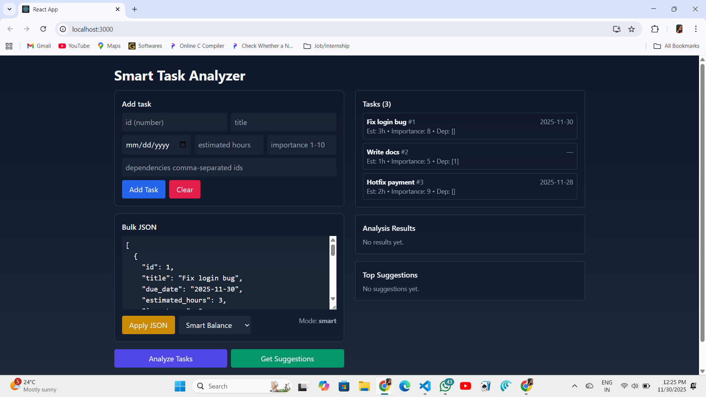

# 🧠 Smart Task Analyzer  
A full-stack decision-support tool that intelligently ranks tasks based on urgency, importance, effort, and dependency impact.  
This project includes a **Django REST backend** for scoring and a **React + Tailwind CSS frontend** for interactive visualization.

---

## 🚀 Project Overview  
Smart Task Analyzer helps users quickly understand which tasks require immediate attention and why.  

Users can:

- Add tasks through a form  
- Import task lists using JSON  
- Choose different prioritization strategies  
- Analyze tasks with a scoring system  
- View detailed score components  
- Get top 3 suggestions  
- Detect circular dependencies  
- Visualize priority using color-coding  

This project fully aligns with the **Smart Task Analyzer Assignment (Singularium Internship 2025)**.

---

# ⭐ Features  

## 🔹 **Frontend**
### ✔ Task Form  
Add tasks one-by-one using:  
- ID  
- Title  
- Due Date  
- Estimated Hours  
- Importance (1–10)  
- Dependencies (comma-separated IDs)

### ✔ JSON Bulk Input  
Paste JSON lists of tasks and update the task table instantly.

### ✔ Sorting Strategy Selector  
Four strategy modes:
- **Smart Balance (default)**
- **Fastest Wins**
- **High Impact**
- **Deadline Driven**

### ✔ Live Analysis  
Displays:
- Score (0–100)
- Color-coded priority (Red → High)
- Score components
- Dependency impact

### ✔ Suggestions  
Shows:
- Top 3 tasks
- Explanation of why each is recommended
- Dependency/delay impact

### ✔ Loading & Error Handling  
- API errors displayed clearly  
- Invalid JSON highlighted  
- Loading indicator  

---

## 🔹 **Backend**
### ✔ Endpoints
| Method | URL | Description |
|--------|-----|-------------|
| `POST` | `/api/tasks/analyze/` | Analyze all tasks & return scored list |
| `POST` | `/api/tasks/suggest/` | Return top 3 task suggestions |

### ✔ Core Scoring Algorithm  
Factors:
- **Urgency** → Nearing due date or overdue  
- **Importance** → User-defined priority  
- **Effort** → Short tasks score higher  
- **Dependency** → Tasks other tasks depend on get boosted  

### ✔ Circular Dependency Detection  
Detects loops like:  
`1 → 2 → 3 → 1`

### ✔ Strategy Weights  
Each strategy uses a different weighting system:

| Strategy | Urgency | Importance | Effort | Dependency |
|----------|---------|------------|--------|------------|
| Smart | 0.35 | 0.35 | 0.15 | 0.15 |
| Fastest | 0.15 | 0.20 | 0.50 | 0.15 |
| High Impact | 0.20 | 0.50 | 0.10 | 0.20 |
| Deadline | 0.60 | 0.20 | 0.10 | 0.10 |

---

# 📊 Scoring Algorithm Explanation  
The scoring algorithm assigns a **0–100 score** to each task based on four dimensions.

### 1️⃣ Urgency  
```

if overdue → urgency = 1.0
else urgency = 1 - (days_until_due / 30)

```

### 2️⃣ Importance  
Importance (1–10) is normalized to (0–1).

### 3️⃣ Effort  
Uses logarithmic scaling to reward smaller tasks:

```

effort_score = 1 / (1 + log(1 + estimated_hours))

```

### 4️⃣ Dependency Impact  
If multiple tasks depend on this one, it becomes more important.

---

# 🧪 Unit Tests  
Located in:

```

backend/tasks/tests.py

````

Covers:
- Urgency impact  
- Quick tasks vs long tasks  
- Dependency-based scoring  
- Cycle detection  

Run tests:

```bash
cd backend
python manage.py test
````

---

# 🛠️ Installation & Setup

## 1) Clone Repository

```bash
git clone <your-repo-url>
cd Smart-Task-Analyzer
```

---

# 🖥 Backend Setup (Django + DRF)

## 2) Create Virtual Environment

```bash
cd backend
python -m venv venv
```

### Activate (Windows):

```bash
.\venv\Scripts\Activate.ps1
```

### Install Dependencies:

```bash
pip install -r requirements.txt
```

## 3) Migrate & Run Server

```bash
python manage.py migrate
python manage.py runserver
```

Backend will run at:
👉 **[http://127.0.0.1:8000](http://127.0.0.1:8000)**

---

# 🌐 Frontend Setup (React + Tailwind)

## 4) Install Dependencies

```bash
cd frontend
npm install
```

## 5) Start React

```bash
npm start
```

Frontend will run at:
👉 **[http://localhost:3000](http://localhost:3000)**

---

# 📁 Folder Structure

```
Smart-Task-Analyzer/
│
├── backend/
│   ├── tasks/
│   │   ├── scoring.py
│   │   ├── views.py
│   │   ├── tests.py
│   │   └── models.py
│   ├── task_analyzer/
│   │   ├── settings.py
│   │   └── urls.py
│   ├── manage.py
│   └── requirements.txt
│
└── frontend/
    ├── src/
    │   ├── App.js
    │   └── index.css
    ├── public/
    └── package.json
```

---

# 📸 Screenshots (Replace with your images)

Add them like:

```

```

---

# 🔮 Future Improvements

* Graph-based dependency visualization
* Adjustable scoring weights (UI slider)
* User login + saved profiles
* AI-based task explanation
* Export as PDF / CSV

---

# 🕒 Time Spent

```
Backend logic:        2 hours  
Frontend UI:          2 hours  
Testing & QA:         1 hour  
Documentation:        1 hour  
Total:                ~6 hours
```

---